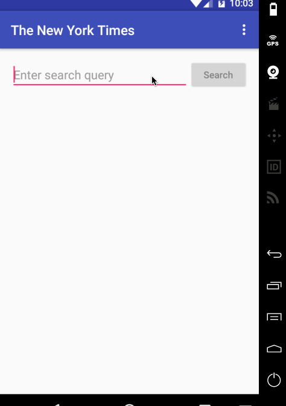

# Project 2 - *NYTimeSearch*

**NYTimeSearch** is an android app that allows a user to search for articles on web using simple filters. The app utilizes [New York Times Search API](http://developer.nytimes.com/docs/read/article_search_api_v2).

Time spent: **8** hours spent in total

## User Stories

The following **required** functionality is completed:

* [x] User can **search for news article** by specifying a query and launching a search. Search displays a grid of image results from the New York Times Search API.
* [ ] User can click on "settings" which allows selection of **advanced search options** to filter results
* [ ] User can configure advanced search filters such as:
  * [ ] Begin Date (using a date picker)
  * [ ] News desk values (Arts, Fashion & Style, Sports)
  * [ ] Sort order (oldest or newest)
* [ ] Subsequent searches have any filters applied to the search results
* [x] User can tap on any article in results to view the contents in an embedded browser.
* [ ] User can **scroll down to see more articles**. The maximum number of articles is limited by the API search.

The following **optional** features are implemented:

* [x] Implements robust error handling, [check if internet is available](http://guides.codepath.com/android/Sending-and-Managing-Network-Requests#checking-for-network-connectivity), handle error cases, network failures
* [ ] Used the **ActionBar SearchView** or custom layout as the query box instead of an EditText
* [ ] User can **share an article link** to their friends or email it to themselves
* [ ] Replaced Filter Settings Activity with a lightweight modal overlay
* [ ] Improved the user interface and experiment with image assets and/or styling and coloring

The following **bonus** features are implemented:

* [ ] Use the [RecyclerView](http://guides.codepath.com/android/Using-the-RecyclerView) with the `StaggeredGridLayoutManager` to display improve the grid of image results
* [ ] For different news articles that only have text or only have images, use [Heterogenous Layouts](http://guides.codepath.com/android/Heterogenous-Layouts-inside-RecyclerView) with RecyclerView
* [ ] Use Parcelable instead of Serializable using the popular [Parceler library](http://guides.codepath.com/android/Using-Parceler).
* [ ] Leverages the [data binding support module](http://guides.codepath.com/android/Applying-Data-Binding-for-Views) to bind data into layout templates.
* [ ] Replace all icon drawables and other static image assets with [vector drawables](http://guides.codepath.com/android/Drawables#vector-drawables) where appropriate.
* [ ] Replace Picasso with [Glide](http://inthecheesefactory.com/blog/get-to-know-glide-recommended-by-google/en) for more efficient image rendering.
* [ ] Uses [retrolambda expressions](http://guides.codepath.com/android/Lambda-Expressions) to cleanup event handling blocks.
* [ ] Leverages the popular [GSON library](http://guides.codepath.com/android/Using-Android-Async-Http-Client#decoding-with-gson-library) to streamline the parsing of JSON data.
* [ ] Leverages the [Retrofit networking library](http://guides.codepath.com/android/Consuming-APIs-with-Retrofit) to access the New York Times API.
* [ ] Replace the embedded `WebView` with [Chrome Custom Tabs](http://guides.codepath.com/android/Chrome-Custom-Tabs) using a custom action button for sharing. (_**2 points**_)

The following **additional** features are implemented:

* [ ] List anything else that you can get done to improve the app functionality!

## Video Walkthrough

Here's a walkthrough of implemented user stories:

GIF created with [LiceCap](http://www.cockos.com/licecap/).

## Notes

Describe any challenges encountered while building the app.

## Open-source libraries used

- [Android Async HTTP](https://github.com/loopj/android-async-http) - Simple asynchronous HTTP requests with JSON parsing
- [Picasso](http://square.github.io/picasso/) - Image loading and caching library for Android

## License

    Copyright (c) 2017 Summit Suen

    Permission is hereby granted, free of charge, to any person obtaining a copy
    of this software and associated documentation files (the "Software"), to deal
    in the Software without restriction, including without limitation the rights
    to use, copy, modify, merge, publish, distribute, sublicense, and/or sell
    copies of the Software, and to permit persons to whom the Software is
    furnished to do so, subject to the following conditions:

    The above copyright notice and this permission notice shall be included in all
    copies or substantial portions of the Software.

    THE SOFTWARE IS PROVIDED "AS IS", WITHOUT WARRANTY OF ANY KIND, EXPRESS OR
    IMPLIED, INCLUDING BUT NOT LIMITED TO THE WARRANTIES OF MERCHANTABILITY,
    FITNESS FOR A PARTICULAR PURPOSE AND NONINFRINGEMENT. IN NO EVENT SHALL THE
    AUTHORS OR COPYRIGHT HOLDERS BE LIABLE FOR ANY CLAIM, DAMAGES OR OTHER
    LIABILITY, WHETHER IN AN ACTION OF CONTRACT, TORT OR OTHERWISE, ARISING FROM,
    OUT OF OR IN CONNECTION WITH THE SOFTWARE OR THE USE OR OTHER DEALINGS IN THE
    SOFTWARE.